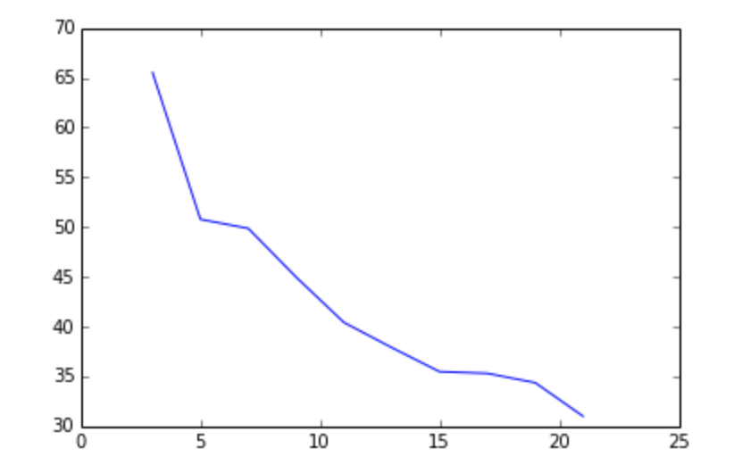

# CMPE 239 HW6 Report 

Shiyu Mou 
011551358
Rank and Score: NO.4 with 0.67 score
### Homework goal 

Text Clustering

The objectives of this assignment are the following:

- Implement the K-Means algorithm
- Deal with text data (news records) in document-term sparse matrix format. 
-  Design a proximity function for text data
- Think about the Curse of Dimensionality
- Think about best metrics for evaluating clustering solutions.

### Approach

**Data Pre-processing** 

- Input data (provided as training data) consists of 8580 text records in sparse format. No labels are provided.
- First I read the dataset and transferred them into CSR matrixes in order to speed up the processing. After transformation the shape of matrix is (8580, 126356). The values are frequency of the words 
- Since in text data (news records), the frequency doesn't always means the important, there are many words that appear frequently but irrelevant. So we scale the CSR matrix by IDF. 
- Since we'll use cosine similarity to compute distance, so I normalized the CSR matrix got above. 

**Feature selection and Dimensionality reduction**

I did try to use TruncatedSVD to reduce the Dimensions of the matrix, but the kernel kept getting died after run those line of code, and since my result is not bad, so I didn't try more on that. 

**K-Means Algorithm**
The sudo code is here: 

~~~ python
# Initialize centroids
centroids = initCentorids(X, K);
for iter = 1:iterations
    # Cluster assignment step: Assign each data point to the
    # closest centroid. idx[i] corresponds to the index
    # of the centroid assigned to example i
     idx = findCentroids(X, centroids)
    # Move centroid step: Compute means based on centroid
    # assignments
    centroids = computeMeans(X, idx, k)
end
~~~

Since we have already normalized the CSR matrix, so in order to compute the distance, we can just multiply two matrix. 
		
	sims = x1.dot(x2.T)
	
When I got distances between every points to clusters, I sorted the result use quicksort and label the points with the label of the min distance centroid. The findCentroids() function return a list a labels of every document. 

After we got new centroid, we compute means with in clusters - points with same labels with computeMeans(). Then we use the results as new centroids. 

Keep doing the same thing above.  

### Evaluation 

Since clustering problem doesn't have labels. We need other way to evaluate the clustering result. 

The method I selected is Calinski and Harabaz score, which is a method for identifying clusters of points in a multidimensional Euclidean space. See paper here: [Link](http://www.tandfonline.com/doi/abs/10.1080/03610927408827101)

For implementation I used sklearn.metrics.calinski_harabaz_score to compute it. 

 
**Parameters finding**

There are only two parameters, the first is k, since it was already given by instruction, we don't need to adjust it. 

The second one, which is pretty important, is the number of iterations. In every iteration, we re-compute the means within clusters as the new centroids. And assign each points to centroids again. So we can expect that: after a number of iterations, the score would stop growing of grow very slow since all the clusters are divided good. 

K from 3 -21

